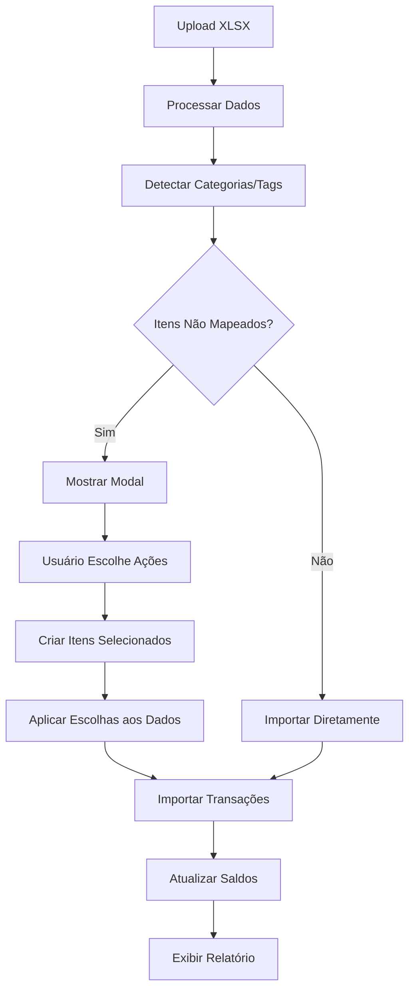

# Guia de Validação de Categorias e Tags - Importação XLSX

## 📋 Visão Geral

A funcionalidade de importação XLSX agora inclui validação automática de categorias e tags, resolvendo inconsistências e perda de dados. O sistema detecta automaticamente itens que não existem no banco e permite ao usuário escolher como proceder.

## 🎯 Fluxo de Validação

### 1. Upload e Processamento Inicial
- O usuário faz upload do arquivo XLSX
- O sistema processa e valida as colunas obrigatórias
- Os dados são exibidos na pré-visualização

### 2. Detecção Automática
- Antes de gravar as transações, o sistema verifica:
  - Quais categorias do XLSX não existem no banco
  - Quais tags do XLSX não existem no banco
- Se não há itens não mapeados, prossegue diretamente

### 3. Modal de Validação
- Se há categorias/tags inexistentes, exibe modal de validação
- Lista todos os itens encontrados com:
  - Nome do item
  - Tipo (categoria ou tag)
  - Número de ocorrências
  - Opções de ação

### 4. Escolhas do Usuário
Para cada item, o usuário pode escolher:
- **Criar**: Adiciona o item ao sistema automaticamente
- **Ignorar**: Remove o item das transações importadas

### 5. Criação Automática
- Cria categorias e tags selecionadas no banco
- Valida duplicatas por nome
- Aplica as escolhas aos dados de importação

### 6. Gravação Transacional
- Salva todas as transações em lote
- Atualiza saldos das contas
- Exibe relatório de sucesso/erro

## 🔧 Funcionalidades Técnicas

### Detecção Inteligente
```typescript
// O sistema detecta automaticamente:
const validationResult = detectUnmappedItems(xlsxData);

// Retorna:
{
  categories: ValidationItem[],
  tags: ValidationItem[],
  hasUnmappedItems: boolean
}
```

### Interface de Validação
- **Modal responsivo** com lista de itens
- **Seleção em massa**: Criar todos / Ignorar todos
- **Controles individuais** para cada item
- **Resumo visual** com estatísticas
- **Detalhes opcionais** para orientação

### Criação Automática
- Cria categorias com tipo padrão (despesa)
- Cria tags com cor padrão
- Valida duplicatas por nome normalizado
- Trata erros de criação graciosamente

### Gravação Transacional
- Processa todas as transações em lote
- Interrompe se há muitos erros (>10%)
- Atualiza saldos apenas se há sucessos
- Relatório detalhado de resultados

## 📊 Interface do Modal

### Informações Exibidas
- **Total de itens** encontrados
- **Quantos serão criados** vs ignorados
- **Lista detalhada** de cada item
- **Controles de ação** para cada item

### Controles Disponíveis
- **Criar Todos**: Marca todos para criação
- **Ignorar Todos**: Marca todos para ignorar
- **Mostrar/Ocultar Detalhes**: Informações adicionais
- **Controles individuais**: Para cada item

### Validações
- **Duplicatas**: Detecta nomes similares
- **Campos obrigatórios**: Valida dados necessários
- **Permissões**: Verifica acesso do usuário

## 🚀 Benefícios

### Para o Usuário
- **Controle total** sobre o que é criado
- **Interface intuitiva** para escolhas
- **Prevenção de perda de dados**
- **Flexibilidade** nas decisões

### Para o Sistema
- **Consistência de dados** garantida
- **Prevenção de duplicatas**
- **Integridade referencial**
- **Auditoria completa**

## ⚠️ Considerações Importantes

### Limitações
- Categorias criadas são do tipo "despesa" por padrão
- Tags recebem cor padrão
- Não há validação de hierarquia de categorias
- Processo é sequencial (não paralelo)

### Melhorias Futuras
- **Validação de hierarquia** de categorias
- **Sugestões inteligentes** baseadas em histórico
- **Importação em lote** de categorias/tags
- **Templates personalizados** por usuário

## 📁 Arquivos Implementados

### Novos Componentes
- `CategoryTagValidationModal.tsx` - Modal de validação
- `useCategoryTagValidation.ts` - Hook de validação

### Modificações
- `SimpleXLSXImporter.tsx` - Integração da validação

## 🔄 Fluxo Completo



## ✅ Critérios de Aceitação

- ✅ Sistema detecta automaticamente categorias/tags inexistentes
- ✅ Modal exibe lista clara de itens encontrados
- ✅ Usuário pode escolher criar ou ignorar cada item
- ✅ Criação automática funciona corretamente
- ✅ Dados são aplicados conforme escolhas
- ✅ Gravação é transacional e confiável
- ✅ Interface é intuitiva e responsiva
- ✅ Relatório final é claro e detalhado
